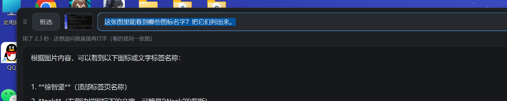

# 问一问 · learnsys

**框一块屏幕 → 问 AI → 答案就出在屏幕顶上那条横栏里。** 不用切窗口、不用去别处找它。



> 这是「学习系统 learnsys」里第一个能用的功能。v1 的「看屏幕 + 听网课声音 → 转写」还在整理，先别用。

## 它能干什么

- **按 `Alt+Q`**（或点横栏上的「框选」）→ 屏幕变暗 → 拖一个矩形框住你想问的那块 → 打字 → 回车
- 答案就出在横栏里 —— **有多长就长多高**（上限约 62% 屏高，再长能滚），15px 大字
- **横栏就是程序本体**（没有别的窗口）：贴在屏幕上方、**能拖着挪**（位置记得住）、**能收成小条**（点一下又展开）
- **任务栏常驻**：有任务栏按钮、右键可「固定到任务栏」；托盘右键有「开机自启」
- **同时只会有一个**：再点一次不会冒第二个，只把横栏**叫回来**（收起 / 最小化 / Win+D 都叫得回来）
- **数据全在本地、按天分**：`D:\学习系统\2026.10.2\`（那天的库 + 那天的截图），删一天 = 删一个文件夹
- **截图用完就删** —— 收起 / 换一张 / 退出时清掉，盘上任何时候最多一张
- 只把**你框的那块图**交给 AI：不带声音、不带窗口上下文

## 快速开始

### 一、用打包好的 exe（最省事）

双击 `dist\问一问\问一问.exe` —— **整个 `dist\问一问\` 文件夹就是它**，拷到哪都能跑，不用装 Python。

### 二、从源码跑

```bat
python -m venv .venv
.venv\Scripts\pip install -r requirements.txt
.venv\Scripts\python -m learnsys.ask.app
```

（或者直接双击 `问一问.cmd` —— 它会优先用打包好的 exe，没打包才按上面这样从源码跑。）

我的环境：Windows 11 + Python 3.14 + PySide6 6.11.2（实测可用）。

## 接哪个 AI（**用之前必看**）

这个工具自己不「会思考」—— 它只负责把「一张图 + 一句话」交给一个**能看图的 AI**。

默认打的是**作者本机 Codex 的中转口**（`http://127.0.0.1:57321/v1`，1 秒级、不用 key）——
那是开发时用的，**别人的电脑上没有这个东西**，所以你会看到「连不上」。

第一次用请打开 **`D:\学习系统\设置.json`**（第一次启动会自动生成），填自己的：

```json
{
  "api_base": "https://api.siliconflow.cn/v1",
  "api_key": "sk-你的key",
  "api_model": "Qwen/Qwen2.5-VL-32B-Instruct"
}
```

**只要满足两条，任何服务都能用**：① OpenAI 兼容（`/chat/completions`）；② **支持图片输入**。
文件里给了三个现成的例子：

| 服务 | `api_base` | `api_model` 例子 |
| --- | --- | --- |
| 硅基流动 | `https://api.siliconflow.cn/v1` | `Qwen/Qwen2.5-VL-32B-Instruct` |
| 智谱 GLM | `https://open.bigmodel.cn/api/paas/v4` | `glm-4v-plus` |
| 通义千问 | `https://dashscope.aliyuncs.com/compatible-mode/v1` | `qwen-vl-max` |

> ⚠️ DeepSeek 官方 API 目前**不支持图片输入**，拿它做「看图问答」不行。
> 改完保存 → **重启问一问**生效。

## 设置（都在 `D:\学习系统\设置.json`）

| 键 | 作用 |
| --- | --- |
| `api_base` / `api_key` / `api_model` | 接哪个 AI（见上） |
| `hotkey` | 框选热键，默认 `alt+q` |
| `api_style` | 留空就自动判断（本机地址走 Responses、其它走 OpenAI 兼容），一般不用填 |

数据根固定在 `D:\学习系统`（一天一个文件夹）。想挪地方，改 `learnsys/config.py` 里的 `DATA_ROOT`。
源码跑时，横栏尺寸 / 数据根这些也都在 `learnsys/config.py` 里调。

## 打包成自己的 exe

```bat
.venv\Scripts\pip install -r requirements-build.txt
```

然后双击 **`打包.cmd`**（第一次一两分钟）→ 出 `dist\问一问\问一问.exe`。

产物约 **117 MB**（Python 和 Qt 都打进去了）；exe 里写死了 `FileDescription = 问一问`
（`版本信息.txt`）—— 所以**任务栏固定出来就叫「问一问」、带自己的图标**，不会变成 Python。

## 固定到任务栏

1. 让问一问跑着（横栏在屏幕上）
2. 在任务栏上找到它的按钮 → **右键 →「固定到任务栏」**
3. 想开机自动起：托盘图标右键 →「开机自启（跟着电脑一起起来）」

## 目录里有什么

| 路径 | 干什么 |
| --- | --- |
| `learnsys/ask/app.py` | **入口**：托盘 + 全局热键 + 框选 → 横栏 |
| `learnsys/ask/bar.py` | **屏幕上那条横栏**（唯一的界面） |
| `learnsys/ask/overlay.py` | 全屏压暗 + 拖一个矩形框 |
| `learnsys/ask/backend.py` | 把「一张图 + 一句话」交给 AI（**协议分派在这**） |
| `learnsys/ask/identity.py` | 自己的任务栏身份（图标 / AUMID / 开始菜单快捷方式） |
| `learnsys/ask/single.py` | 只留一个问一问：互斥体 + 本地套接字把横栏叫回来 |
| `learnsys/ask/icon.py` | 画那张图标（蓝底白「问」） |
| `learnsys/ask/usage.py` | 算本程序占了多少盘 |
| `learnsys/config.py` | 所有可调参数（数据根 / 热键 / 横栏尺寸…） |
| `问一问.py` · `问一问.spec` · `版本信息.txt` | 打包入口 + PyInstaller 配置 |
| `打包.cmd` | 双击就打包出 exe |
| `问一问.cmd` | 启动（优先用打包好的 exe） |
| `main.py` · `learnsys/asr.py` 等 | v1（录屏 + 听声 + 转写）还没整理，先别用 |

## 数据长什么样

```
D:\学习系统\
  设置.json            ← 你填 API key 的地方
  界面设置.json        ← 横栏的位置 / 收起状态（程序自己写）
  2026.10.2\           ← 一天一个文件夹
    learnsys.db        ← 那天的问答（SQLite）
    截图\              ← 临时截图（用完即删）
```

`learnsys.db` 里的 `asks` 表：`id, ts, question, answer, ms, backend` —— **图不留盘，只留问答文字**。

## 已知限制

- **只按图回答**：不带声音、不带上一题的上下文（v1 的录屏听声还没接回来）
- 走本机 Codex 中转时**必须 Codex 开着**；换成自己的 key 就不依赖它
- 全局热键被别的程序占用时，托盘会弹提示（改 `hotkey` 即可）

## 许可

MIT —— 见 `LICENSE`。
